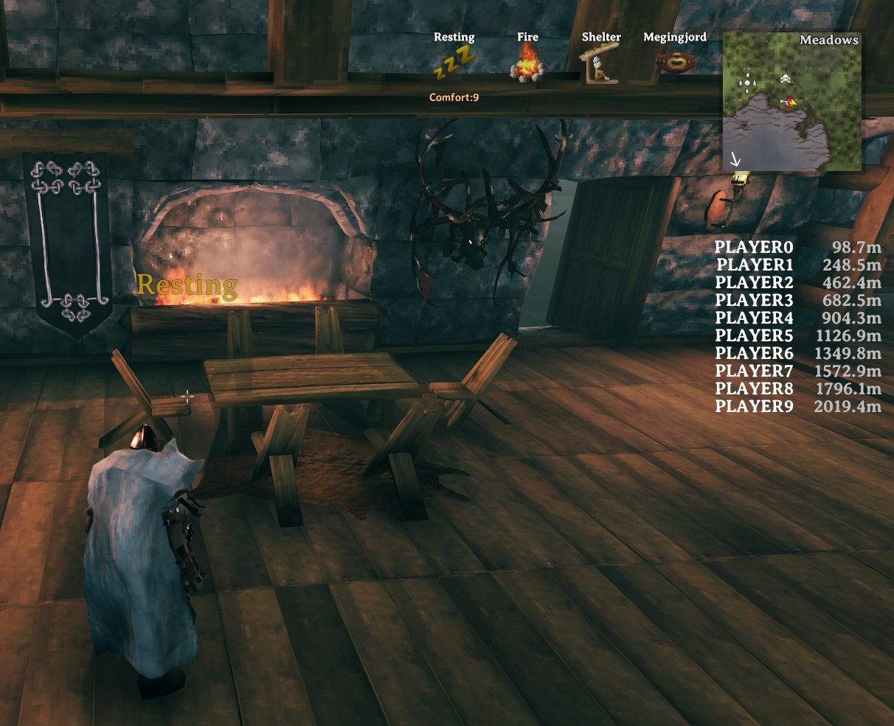

# Connected players list

Mod for Valheim to show currently connected players and the distance to them.

References you'll need to put into `Libs/`:
- [BepInEx.dll](https://github.com/BepInEx/BepInEx/releases)
- 0Harmony.dll (best taken from BepInEx release above, alternatively from the [official release](https://github.com/pardeike/Harmony/releases))
- assembly_valheim.dll (found in `valheim_Data/Managed`)
- UnityEngine.dll (this and below can be found in `valheim_Data/Managed`)
- UnityEngine.CoreModule.dll
- UnityEngine.IMGUIModule.dll
- UnityEngine.TextRenderingModule.dll
- UnityEngine.UI.dll

Note: If you're missing Unity methods you can also get full Unity dlls from the Unity installation at `Unity\Editor\Data\Managed`.

Links:
- https://bepinex.github.io/bepinex_docs/v5.4.4/articles/dev_guide/plugin_tutorial/index.html
- https://github.com/dnSpy/dnSpy
- https://github.com/aedenthorn/ValheimMods
- https://github.com/valheimPlus/ValheimPlus
